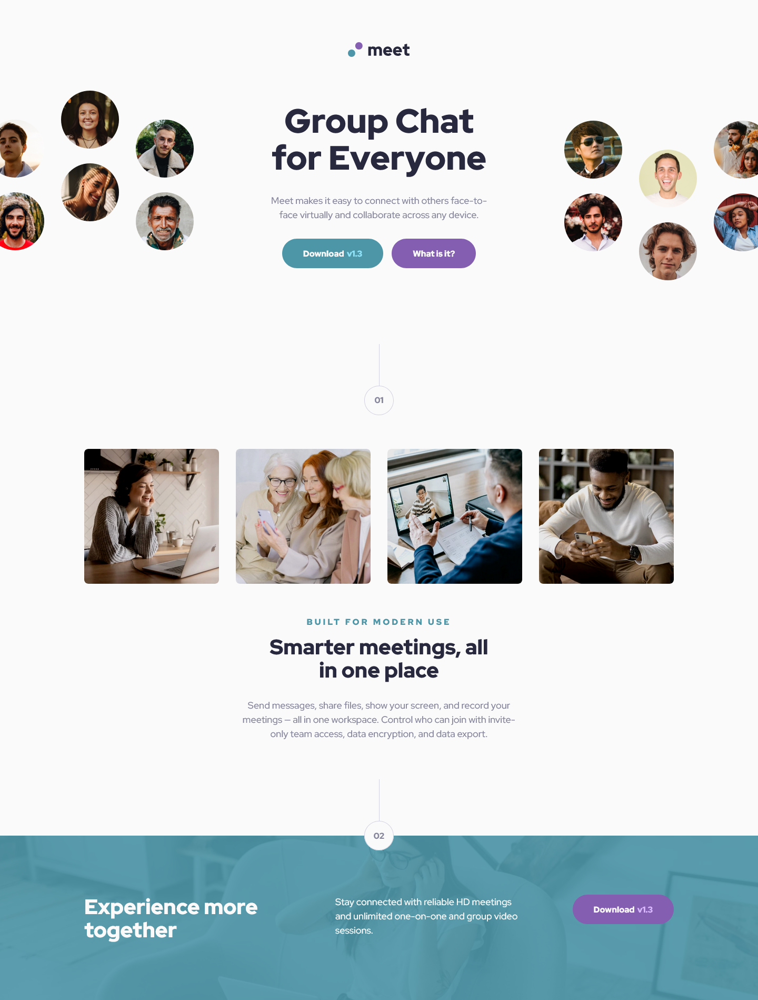

# Frontend Mentor - Meet landing page solution

This is a solution to the [Meet landing page challenge on Frontend Mentor](https://www.frontendmentor.io/challenges/meet-landing-page-rbTDS6OUR). Frontend Mentor challenges help you improve your coding skills by building realistic projects. 

## Table of contents

- [Overview](#overview)
  - [The challenge](#the-challenge)
  - [Screenshot](#screenshot)
  - [Links](#links)
- [My process](#my-process)
  - [Built with](#built-with)
  - [What I learned](#what-i-learned)
  - [Continued development](#continued-development)
  - [Useful resources](#useful-resources)
- [Author](#author)

## Overview

### The challenge

Users should be able to:

- View the optimal layout depending on their device's screen size
- See hover states for interactive elements

### Screenshot

### Links

- [Solution URL](https://github.com/loki-pepe/meet-landing-page)
- [Live Site URL](https://loki-pepe.github.io/meet-landing-page/)

## My process

### Built with

- Semantic HTML5 markup
- CSS custom properties
- Flexbox
- CSS Grid
- Mobile-first workflow

### What I learned

I acquainted myself with responsive sizing using the CSS `clamp` function. Also, I got a better understanding of background image manipulation, and the whole project served as great CSS practice as it was my largest project so far (regarding CSS).

The biggest dilemma was how to implement the responsive hero image in the header. After trying out several options, I opted for using a `::before` pseudo-element on smaller screen sizes, with the hero image being a background image of the pseudo-element, while for the desktop layout the `::before` element is removed, and the two hero images are set as the background of the `div` within the header.

### Continued development

I would like to get a better grasp of building responsive layouts using CSS Grid and Flexbox, and I plan on using the `clamp` function for responsive spacings in the future.

### Useful resources

- [Learn web development by web.dev](https://web.dev/learn) - Great courses for web development basics.
- [MDN Web Docs](https://developer.mozilla.org/) - An extensive resource on everything HTML and CSS.
- [W3Schools](https://www.w3schools.com/) - Web tutorials.

## Author

- GitHub - [Lovro Peraić](https://github.com/loki-pepe)
- Frontend Mentor - [@loki-pepe](https://www.frontendmentor.io/profile/loki-pepe)
